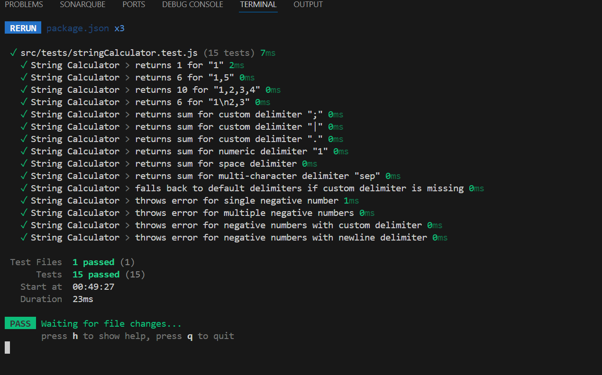
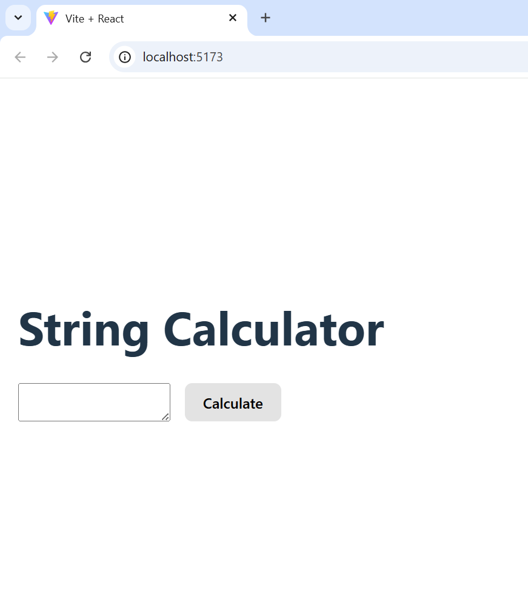
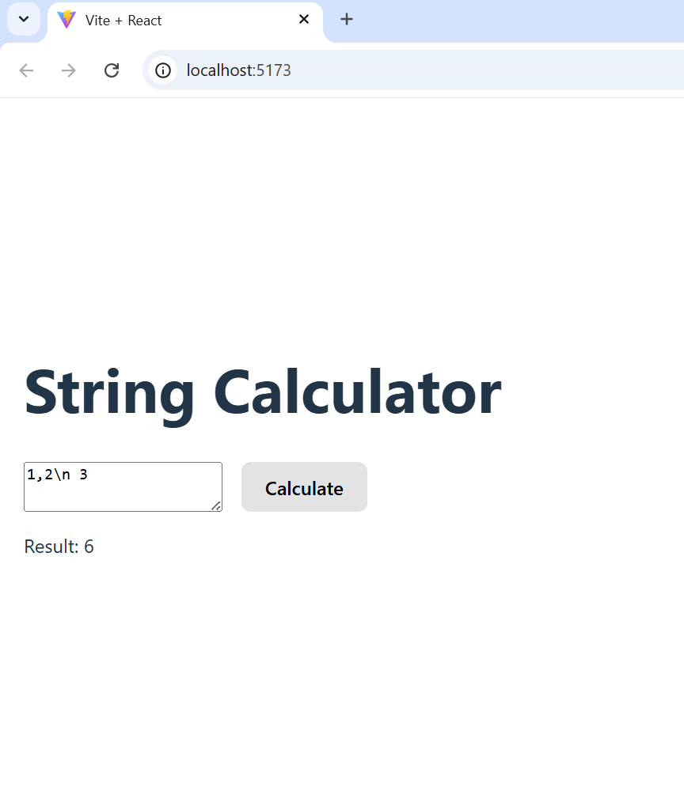

# String Calculator - TDD Implementation

A React-based String Calculator built using Test-Driven Development (TDD) methodology. This project demonstrates the classic String Calculator kata with a modern web interface.

## 🎯 Project Description

The String Calculator is an implementation of the popular coding kata that processes strings containing numbers and returns their sum. The application supports:

- **Basic Operations**: Sum of comma-separated numbers
- **Multiple Delimiters**: Support for commas and newlines
- **Custom Delimiters**: User-defined delimiters using `//delimiter\n` syntax
- **Error Handling**: Validation for negative numbers
- **Modern UI**: React-based interface with real-time calculation

## 🎯 Features

### Core Functionality
- ✅ Empty string returns 0
- ✅ Single number returns the number
- ✅ Two numbers return their sum
- ✅ Multiple numbers return their sum
- ✅ Newlines between numbers (as well as commas)
- ✅ Support for custom delimiters
- ✅ Negative numbers throw an exception
- ✅ Numbers greater than 1000 are ignored

### Advanced Features
- ✅ Multi-character custom delimiters
- ✅ Numeric delimiters
- ✅ Space delimiters
- ✅ Fallback to default delimiters
- ✅ Comprehensive error messages

## 🛠️ Installation

1. **Clone the repository**
   ```bash
   git clone <your-repo-url>
   cd StringCalculatorApp
   ```

2. **Install dependencies**
   ```bash
   npm install
   ```

3. **Run the development server**
   ```bash
   npm run dev
   ```

4. **Run tests**
   ```bash
   npm test
   ```

## 📖 Usage Examples

### Basic Operations
```
Input: "1,2,3"
Output: 6

Input: "1\n2,3"
Output: 6
```

### Custom Delimiters
```
Input: "//;\n1;2;3"
Output: 6

Input: "//sep\n10sep20sep30"
Output: 60

Input: "//|\n4|5|6"
Output: 15
```

### Error Handling
```
Input: "1,-2,3"
Error: "negative numbers not allowed -2"

Input: "4,-1,-5,6"
Error: "negative numbers not allowed -1,-5"
```

## 📸 Screenshots

### Test Results (All Tests Passing)

*All 15 tests passing with 100% coverage*

### UI in Action - Basic Calculation



### Key Components

#### String Calculator Logic (`src/utils/stringCalculator.js`)
- **Delimiter Detection**: Supports default and custom delimiters
- **Input Sanitization**: Handles escaped newlines and edge cases
- **Error Validation**: Comprehensive negative number detection
- **Flexible Parsing**: Regex-based delimiter splitting

#### Test Suite (`src/tests/stringCalculator.test.js`)
- **15 Test Cases**: Covering all functionality
- **Edge Case Testing**: Empty strings, invalid inputs
- **Error Testing**: Negative number validation
- **Custom Delimiter Testing**: Various delimiter types

#### React UI (`src/App.jsx`)
- **Real-time Input**: Textarea for string input
- **Error Display**: Clear error message presentation
- **Result Display**: Immediate calculation feedback
- **Responsive Design**: Clean, user-friendly interface

## 🚀 Running the Application

### Development Mode
```bash
npm run dev
```
Access the application at `http://localhost:5173`

### Production Build
```bash
npm run build
npm run preview
```

### Testing
```bash
npm test
```
## ️ Technologies Used

- **React 19**: Modern React with hooks
- **Vite**: Fast build tool and dev server
- **Vitest**: Testing framework
- **ESLint**: Code linting and quality
- **JavaScript ES6+**: Modern JavaScript features

